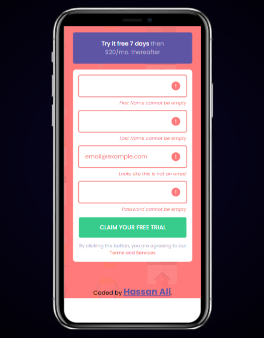

# 📝 Intro Component with Sign-Up Form

## Frontend Mentor – Intro Component with Sign-Up Form Solution

This is a solution to the [Intro component with sign-up form challenge on Frontend Mentor](https://www.frontendmentor.io/challenges/intro-component-with-signup-form-BJ-NpZQy).  
Frontend Mentor challenges help you improve your coding skills by building realistic projects.

---

## 📌 Project Overview

This project is a responsive sign-up form with client-side validation and clear visual feedback for invalid and valid states.

The main goal of this project was not just UI replication, but to practice **real-world frontend engineering concepts**, including:

- Form submission handling
- DOM event management
- State-driven UI (valid / invalid states)
- Reducing conditional repetition in JavaScript
- Clean separation of concerns between HTML, CSS, and JavaScript

---

## 🌟 Key Features

- Client-side validation for all input fields
- Inline error messages for invalid inputs
- Visual error state using icons and outlines
- Fake email hint handling (`email@example.com`)
- Error state clears automatically on re-focus
- Submission success message shown only when all fields are valid
- Fully responsive layout (mobile → desktop)

---

## 🛠 Tech Stack

- **HTML5** – Semantic markup, accessible form structure
- **CSS3** – CSS variables, grid layout, responsive design, state-based styling
- **JavaScript (ES6+)** – DOM manipulation, event handling, UI state management

---

## ⚙ Architecture & Approach

### JavaScript Strategy

- Fields are defined in a single configuration array to avoid repetition:

```js
const fields = [
  { el: userFirstName, name: "First Name" },
  { el: userLastName, name: "Last Name" },
  { el: userEmail, name: "Email", fakeValue: "email@example.com" },
  { el: userPassword, name: "Password" },
];
## ⚙ Architecture & Validation Approach

- One `submit` event handler validates all fields using a loop
- One `focusin` handler removes invalid state using event delegation
- A single `allValid` flag controls the submission success state
- No over-abstraction — logic stays readable and debuggable
```
---

## 🧠 Validation Philosophy

- UI state is controlled entirely by CSS classes
- JavaScript decides **when** a state changes, not **how it looks**
- No inline styles or duplicated conditional logic
- Easily scalable if more fields are added

---

## 🎨 CSS Structure & Styling Philosophy

CSS is organized in clear layers:

1. Reset and base styles
2. CSS variables for colors, fonts, and weights
3. Utility classes (e.g. `.sr-only`)
4. Component styles (card, inputs, buttons)
5. State classes:
   - `.is-invalid`
   - `.is-valid`
6. Responsive media queries

This approach keeps styling predictable and state-driven.

---

## ♿ Accessibility

- Screen-reader-only labels using `.sr-only`
- Semantic form structure (`<form>`, `<fieldset>`, `<label>`)
- Focus states preserved for keyboard users
- Error messages are text-based, not icon-only
- No JavaScript-dependent layout shifts

---

## 📚 Learning Outcomes

### Core JavaScript & DOM Skills

- Used `querySelector` and `closest()` for clean DOM traversal
- Practiced `submit` and `focusin` event handling
- Reduced repetitive `if` statements using configuration-based logic
- Learned how small state bugs emerge in form handling and how to fix them

### State-Driven UI

- Validation logic separated from visual styling
- Learned to think in UI states instead of individual conditions
- Implemented predictable class-based state transitions

### CSS & Layout Learnings

- Practical use of CSS variables for consistency
- Responsive grid layout without unnecessary wrappers
- State-based styling instead of inline JavaScript styles
- Better understanding of where utility and state classes belong

### Engineering Mindset

- Iterated from a naive solution to a scalable one
- Chose clarity over premature abstraction
- Manually tested all edge cases
- Focused on maintainability, not just passing the challenge

---

## 🖥️ Screenshots

### 📱 Mobile View


### 🎯 Invalid state



### 🖥️ Desktop View and Valid State


---

## 🌐 Live Demo

[Click here to view live demo](https://intro-component-with-signup-form-js.vercel.app/)

---

## 👨‍💻 Author

**Hassan Ali**
Frontend Mentor Profile:
https://www.frontendmentor.io/profile/hassan-ali-byte

---

## 💬 Feedback

Feedback, suggestions, and code reviews are always welcome.
If you have ideas around form UX, validation patterns, or scalability, feel free to share.

